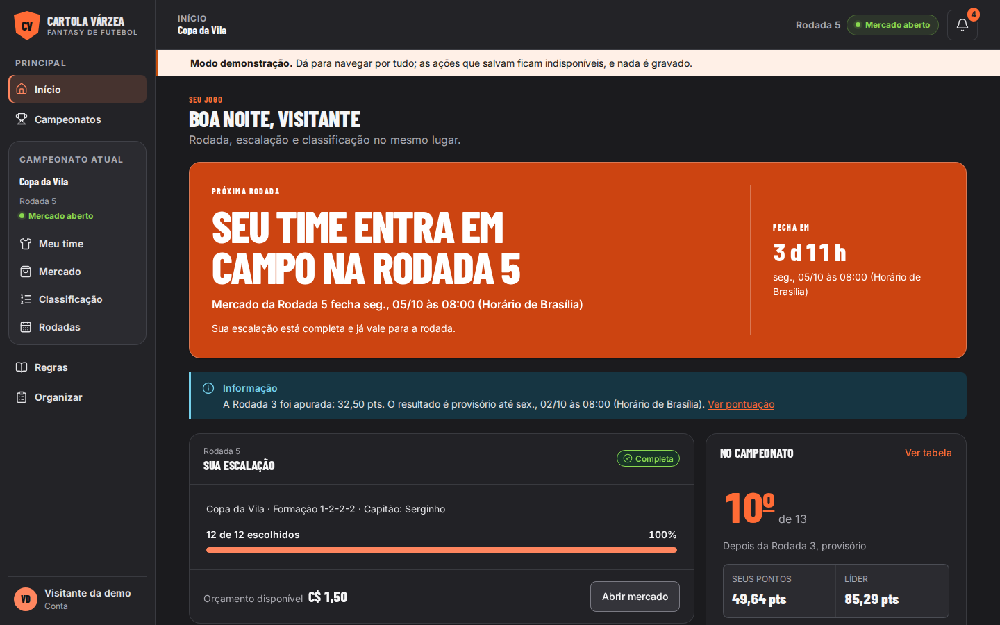
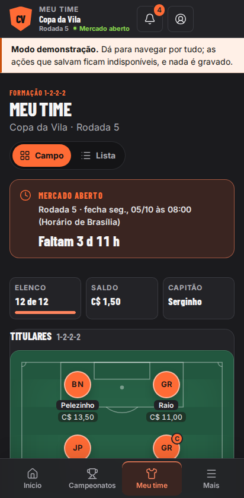
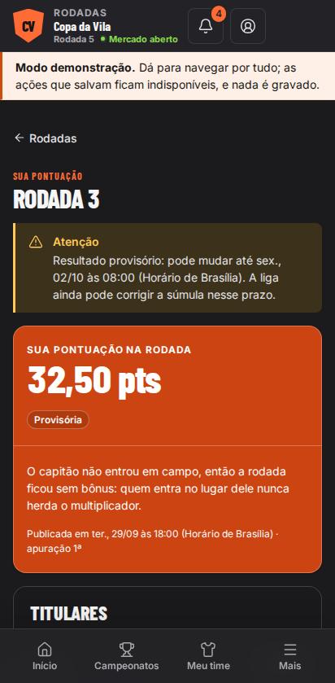
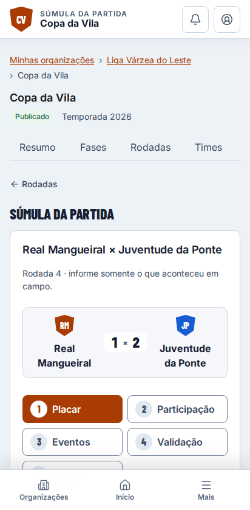
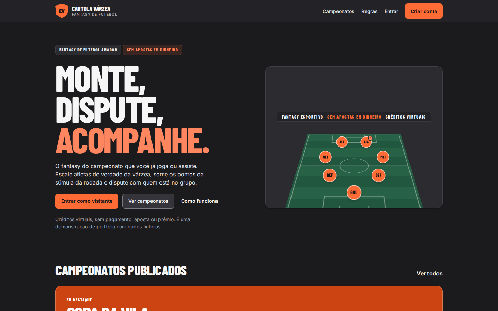
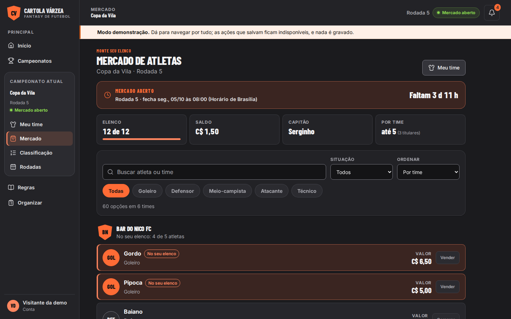
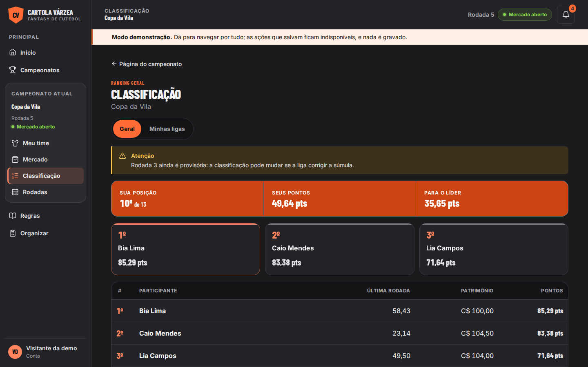
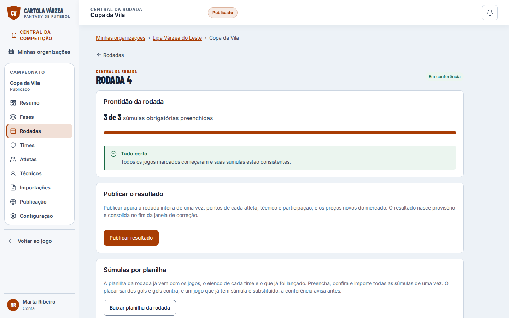
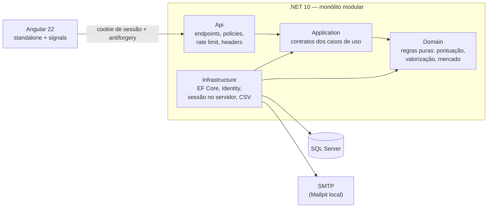
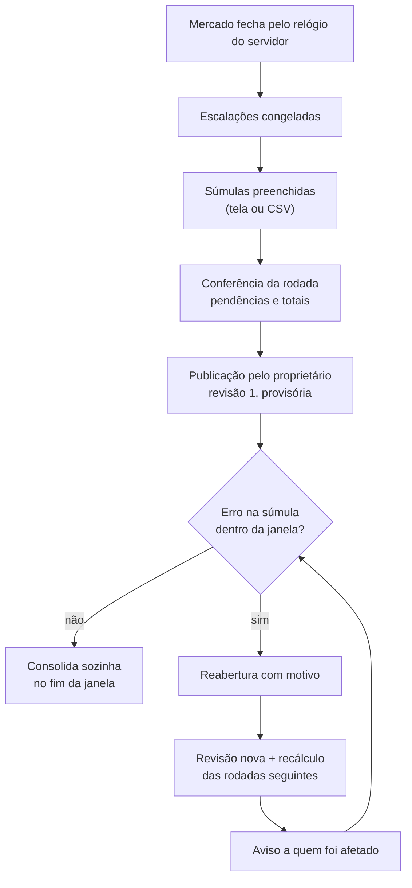

# Cartola Várzea

[](https://github.com/pedromeireles23/cartola-varzea/actions/workflows/ci.yml)
[](LICENSE)
[](https://github.com/pedromeireles23/cartola-varzea/releases/tag/v1.0.0-demo)

Fantasy de futebol para campeonatos amadores — Fut7, futsal e campo. Quem organiza cadastra o campeonato, os times, os atletas e as súmulas; quem joga monta o time com os atletas de verdade do campeonato, disputa o ranking geral e cria ligas com os amigos.

É um projeto de portfólio, **concluído**: uma demonstração completa com dados fictícios, créditos virtuais e nenhum pagamento, aposta ou prêmio. O nome é só deste repositório; o projeto não tem relação com o Cartola FC.



<p>
  
  
  
</p>

## O problema

Fantasy de futebol existe para a Série A, não para o campeonato do bairro. Ali, o resultado sai de uma súmula preenchida à mão, às vezes com erro e corrigida dias depois; os jogos são adiados porque choveu; e o mesmo time pode jogar duas vezes na rodada. O desafio do projeto foi fazer um fantasy que aguenta essa realidade: pontuação auditável, correção sem bagunçar o que já foi publicado, e uma operação simples o bastante para quem organiza nas horas vagas.

## O que dá para fazer

| Quem | O quê |
|---|---|
| **Visitante** | Entra com um clique, sem senha, numa conta só de leitura, e percorre o jogo e a central da organização inteiros |
| **Quem joga** | Entra num campeonato, compra no mercado com orçamento, escala em três formações, escolhe capitão e banco, acompanha a pontuação item por item e disputa o ranking geral e ligas privadas por código |
| **Quem organiza** | Cria o campeonato em rascunho, configura fases e grupos, cadastra ou importa por CSV times, atletas e técnicos, monta rodadas e partidas, preenche súmulas, confere e publica o resultado — e corrige depois, se precisar |
| **Administração** | Aprova quem pede para organizar; cada organização tem proprietário e auxiliares convidados |

## Ver funcionando

O projeto não está hospedado — de propósito, para não ter custo recorrente. Os prints abaixo saem do build de produção, e a demonstração inteira roda localmente em poucos comandos (veja [Rodar localmente](#rodar-localmente)).

| Landing | Mercado |
|---|---|
|  |  |
| **Classificação** | **Central da rodada** |
|  |  |

## Arquitetura

Monólito modular em .NET 10, com o Angular 22 servido pela mesma origem. A escolha e os limites entre módulos estão no [ADR-001](docs/adr/0001-monolito-modular.md).



Os testes de arquitetura impedem que o Domain e a Application dependam de EF Core, ASP.NET ou Identity.

## Apuração e correção

O coração do produto. Publicar uma rodada grava uma **revisão imutável** da apuração — pontos de cada atleta por partida e item, técnico, total de cada participação, média da posição e preço novo de cada ativo ([ADR-003](docs/adr/0003-apuracao-em-revisoes-imutaveis.md)). Corrigir nunca edita o passado: gera uma revisão nova e recalcula em cadeia as rodadas seguintes, numa transação só.



O cálculo é uma função pura das súmulas e da escalação congelada, com a regra de pontuação versionada por modalidade ([ADR-008](docs/adr/0008-perfis-de-modalidade-versionados.md)) e coberta por testes de ouro. Partida adiada não pontua; time com duas partidas soma as duas.

## Decisões-chave

- **Monólito modular** em vez de microsserviços: um time de uma pessoa, um banco, transações locais ([ADR-001](docs/adr/0001-monolito-modular.md)).
- **Revisões imutáveis** para a apuração, com o preço atual vindo da última ([ADR-003](docs/adr/0003-apuracao-em-revisoes-imutaveis.md)).
- **Isolamento por organização** com autorização em camadas: papel global não dá escopo; o acesso vem de ser membro da organização ([ADR-004](docs/adr/0004-isolamento-por-organizacao.md)).
- **Perfis de modalidade versionados no código**, para que mudar a regra nunca reescreva rodada antiga ([ADR-008](docs/adr/0008-perfis-de-modalidade-versionados.md)).
- **CSV com conferência e importação, sem staging**: conferir não grava nada; importar é tudo ou nada; reenviar não duplica ([ADR-009](docs/adr/0009-importacao-csv-sem-staging.md)).
- **Sem job agendado**: fechamento de mercado, congelamento e consolidação são derivados do relógio na leitura.

## Segurança, autorização e idempotência

- Sessão em cookie `HttpOnly`, guardada no servidor: o logout revoga aquela sessão sem derrubar as outras da conta, e redefinir a senha invalida todas. Nenhum token no navegador.
- Antiforgery em toda mutação; cabeçalhos de segurança com CSP; HSTS fora do desenvolvimento; rate limit por risco de rota.
- Toda rota privada passa por uma policy de papel e escopo, e um teste compara as rotas registradas com a matriz de autorização documentada: rota nova sem decisão explícita reprova o CI.
- A conta de visitante é somente leitura no servidor, inclusive por chamada direta à API.
- Publicação, correção e importação são transacionais e idempotentes; edições concorrentes são protegidas por versão.
- No CI: gitleaks no histórico inteiro, analisadores do .NET com aviso quebrando o build e dependências travadas por lockfile, atualizadas pelo Dependabot.

Vulnerabilidades: veja o [SECURITY.md](SECURITY.md).

## Qualidade

| Camada | O que roda |
|---|---|
| Backend | 519 testes: unitários (incluindo os testes de ouro da pontuação), de arquitetura e de integração contra SQL Server real em container |
| Frontend | 403 testes de componente e serviço, ESLint, Prettier e build de produção com orçamento de tamanho |
| E2E | 41 cenários em Playwright, cada um em desktop e no Pixel 7, contra API e banco reais, lendo e-mails do Mailpit — inclusive a jornada inteira, do mercado fechando pelo relógio à rodada corrigida |
| Acessibilidade | axe (WCAG 2.1 A e AA) nas três áreas em 320, 412, 820 e 1440 px, foco nunca escondido sob barras fixas, zoom de 200% e o roteiro conferido com o TalkBack |
| Regressão visual | oito telas-chave em desktop e celular, sobre o build de produção, sem API nem banco |

Tudo isso roda no [CI](.github/workflows/ci.yml) a cada push.

## Desafios e trade-offs

- **Relógio como fonte da verdade.** Mercado, congelamento e consolidação dependem só do relógio do servidor, sem job agendado. Simplifica a operação, mas exigiu que os testes controlassem o tempo de ponta a ponta — inclusive o pote de cookies do cliente de teste, que descartava a sessão pelo relógio da máquina.
- **Correção sem reescrever o passado.** Revisões imutáveis custam mais espaço e um recálculo em cadeia, mas tornam cada total auditável e permitem explicar a quem joga de onde veio cada ponto.
- **Sessão no servidor.** Toda resposta autenticada renova o cookie; uma resposta atrasada podia recriar a sessão depois do logout. A sessão passou a viver no banco, ao custo de uma leitura e uma escrita por requisição.
- **Visual de jogo sem perder acessibilidade.** O redesign mediu LCP e CLS contra a versão anterior e aceitou, por decisão registrada, um LCP até 27% maior nas telas mais ricas, em troca de FCP melhor em todas e CLS zero.

## Limitações e fora de escopo

- Não é um produto comercial: sem pagamentos, prêmios, SLA ou operação real. Os dados são fictícios.
- Não está hospedado. A infraestrutura em Azure ficou no backlog.
- Sem login com Google, sem fotos de atleta e sem pontuação ao vivo.
- Sem MFA: necessário antes de qualquer uso real, especialmente para a administração.
- A variação de posição entre rodadas e o desempate por cartões não estão implementados.

## Rodar localmente

Pré-requisitos: Docker, .NET SDK 10.0.2xx e Node.js 24.19 (detalhes no [CONTRIBUTING](CONTRIBUTING.md)). No Windows PowerShell:

```powershell
git clone https://github.com/pedromeireles23/cartola-varzea.git
cd cartola-varzea
dotnet tool restore

# Containers (SQL Server, Azurite, Mailpit), .env com senha aleatória e migrations
powershell -ExecutionPolicy Bypass -File .\infra\scripts\bootstrap.ps1

# Demonstração: recria o banco Fut7Fantasy_Demo com três semanas de campeonato
powershell -ExecutionPolicy Bypass -File .\infra\scripts\demo-reset.ps1

# API apontando para a demo, com a entrada de visitante ligada
$senha = (Get-Content .env | Where-Object { $_ -like 'MSSQL_SA_PASSWORD=*' }) -replace '^MSSQL_SA_PASSWORD=', ''
$env:Database__ConnectionString = "Server=127.0.0.1,1433;Database=Fut7Fantasy_Demo;User Id=sa;Password=$senha;TrustServerCertificate=True"
$env:DemoAccess__Enabled = 'true'
$env:DemoAccess__ViewerEmail = 'visitante@demo.cartola-varzea.test'
dotnet run --project src\backend\src\Fut7Fantasy.Api
```

Em outro terminal:

```powershell
cd src\frontend
npm ci
npm start
```

Abra `http://localhost:4200` e clique em **Entrar como visitante**. As senhas das contas da organização e da administração da demo ficam no `.env`, geradas pelo `demo-reset`. A massa fictícia, inclusive os CSV de exemplo, está em [`infra/dados-demo`](infra/dados-demo).

Esse caminho foi conferido num clone limpo do repositório para a release, com o roteiro inteiro da demonstração rodando por script (`tests/frontend/demo`).

## Licença

Código sob a licença [MIT](LICENSE). Fontes Inter e Barlow Condensed sob a SIL Open Font License 1.1, auto-hospedadas pelo Fontsource; ícones [Lucide](https://lucide.dev) sob a licença ISC. Ilustrações, estádio, escudos e a imagem de compartilhamento são desenhados no próprio projeto.
